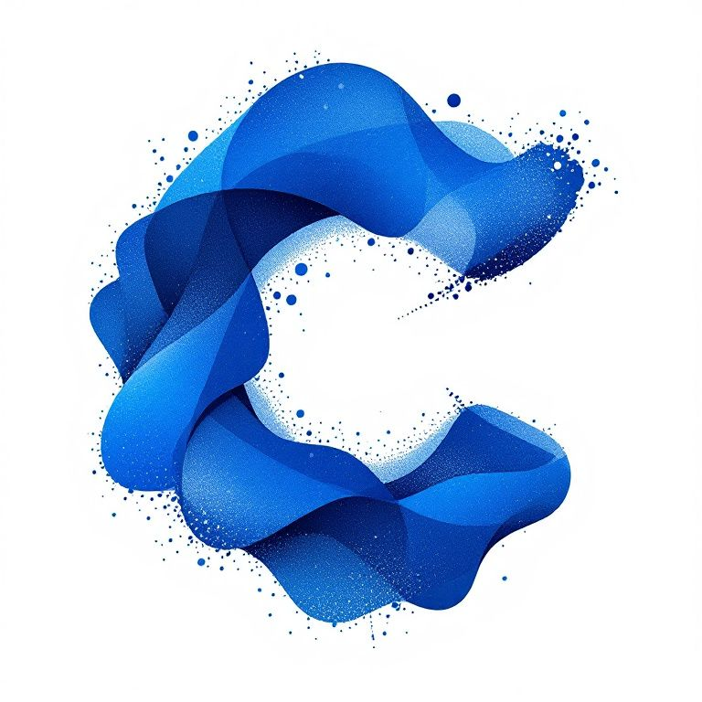

<p align="center">
  
</p>

# Coverxity

Coverxity is an AI-powered tool that helps you find the perfect cover images for your content. Using advanced image search and AI suggestions, it generates relevant visual options based on your article title.

## Features

- **AI-Powered Image Search**: Enter your article title and get AI-curated image suggestions
- **Multiple Search Categories**: Receive images across different relevant categories for your content
- **Image Management**:
  - Download images in original quality
  - Copy image URLs with one click
  - Create optimized OG images (1200x630) with built-in cropping tool
- **Responsive Design**: Works seamlessly across desktop and mobile devices

## Tech Stack

- **Framework**: Next.js 14 with App Router
- **Styling**: Tailwind CSS
- **UI Components**: shadcn/ui
- **Image Processing**: react-image-crop
- **Image Source**: Pexels API
- **AI Integration**: OpenAI API
- **State Management**: React Hooks

## Getting Started

1. Clone the repository
2. Install dependencies:

```bash
npm install
```

3. Create a `.env` file with the following variables:

```
OPENAI_API_KEY=your_openai_api_key
PEXELS_API_KEY=your_pexels_api_key
```

4. Run the development server:

```bash
npm run dev
```

5. Open [http://localhost:3000](http://localhost:3000) in your browser

## Usage

1. Enter your article title in the search bar
2. Wait for AI to analyze and suggest relevant image categories
3. Browse through the suggested images in each category
4. For each image you can:
   - Download in original quality
   - Copy the image URL
   - Create an optimized OG image with custom cropping
   - View photographer credits and source

## Contributing

Pull requests are welcome. For major changes, please open an issue first to discuss what you would like to change.

## Credits

- Photos provided by [Pexels](https://www.pexels.com)
- UI components by [shadcn/ui](https://ui.shadcn.com)
